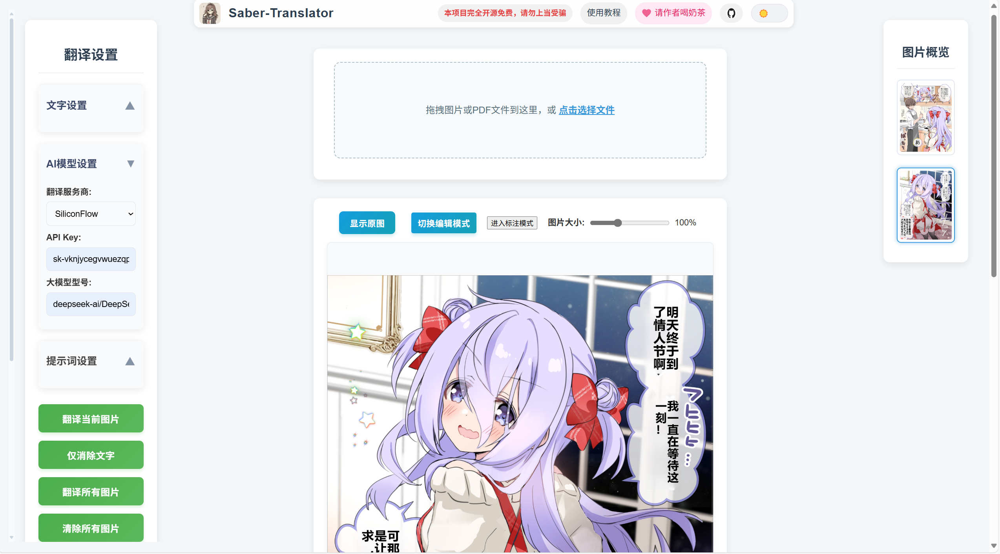
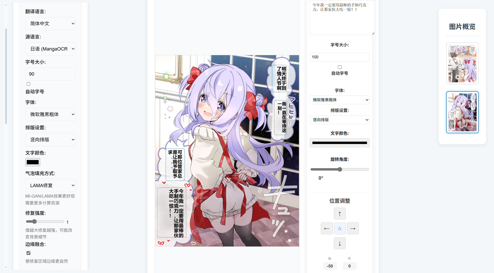
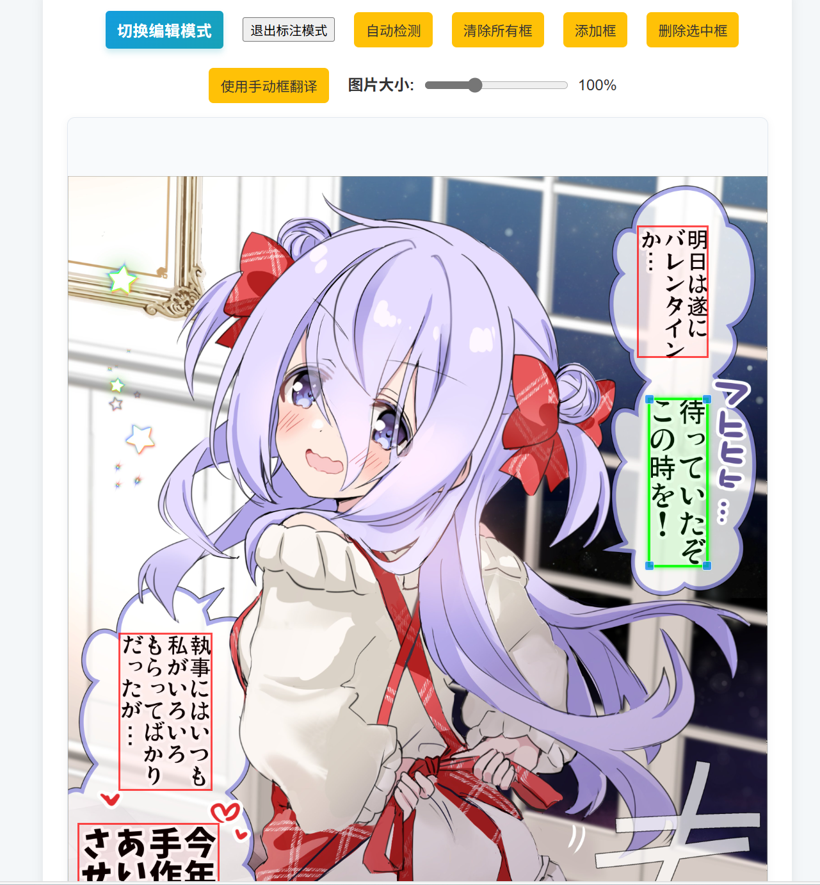
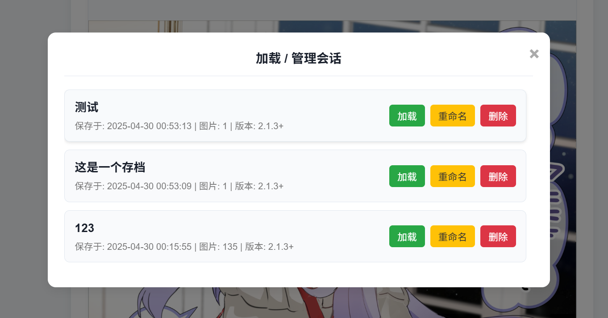
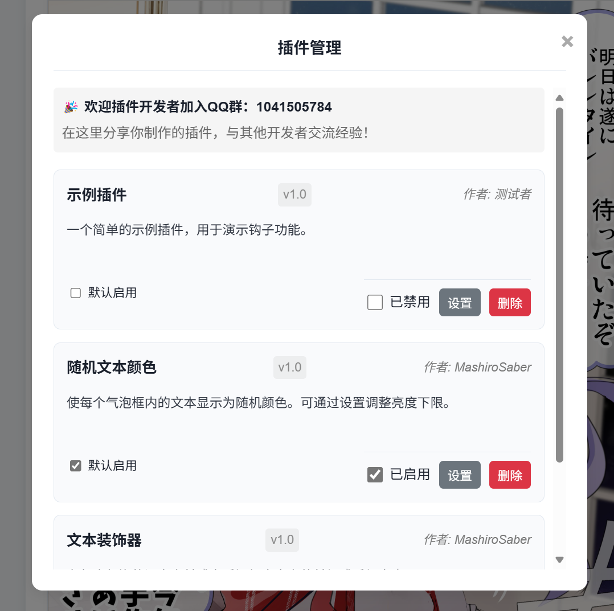
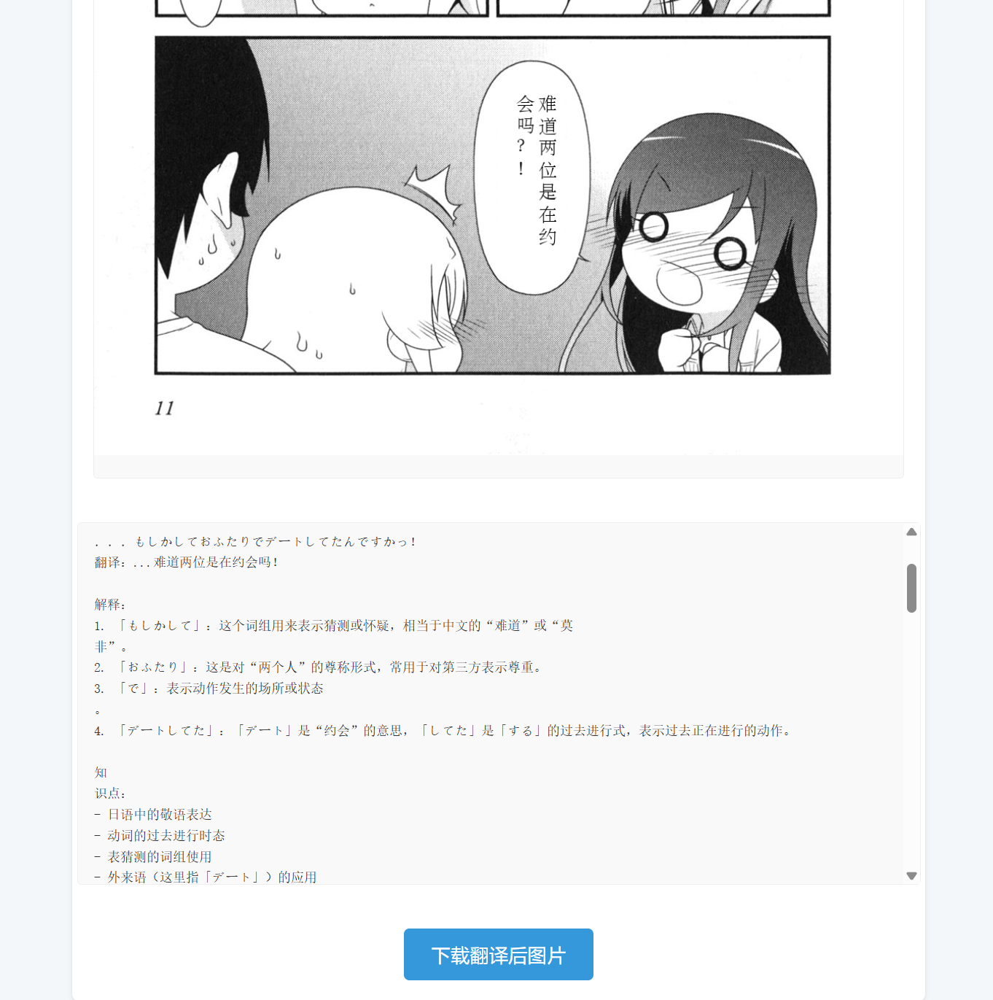

<p align="center">
    
</p>

<h1 align="center">Saber-Translator</h1>

<p align="center">
    ✨ 你的专属 AI 漫画/图像翻译与编辑神器，支持多种模型、手动标注、精细编辑、会话管理和插件扩展！✨
</p>

<p align="center">
    <a href="https://github.com/MashiroSaber03/Saber-Translator/stargazers">
        
    </a>
    <a href="LICENSE">
        
    </a>
</p>

<div align="center">
    <a href="https://github.com/MashiroSaber03/Saber-Translator/issues">问题反馈 / 建议</a>
    |
    <a href="http://www.mashirosaber.top" target="_blank">使用教程</a>
</div>

**求职广告：本人是26届应届本科生，走过路过的老板们给个工作机会好不好😭😭😭😭😭😭😭😭**

---

## ✨ 主要功能

Saber-Translator 提供了一站式的漫画/图像翻译解决方案，集成了从内容导入到编辑输出的完整工作流，其核心功能包括：

1.  **灵活的源文件处理**:
    *   支持上传常见的**图像格式** (如 JPG, PNG, WEBP 等) 和 **PDF** 漫画文件。
    *   便捷的**拖拽上传**功能，PDF 文件会自动提取其中包含的图像。
2.  **精准的文本区域检测与编辑**:
    *   采用自训练**YOLOv5** 模型自动检测漫画中的对话气泡和文本区域。
    *   强大的**手动标注模式**：
        *   允许用户在图片上**绘制新的文本框**。
        *   支持通过鼠标**拖动**已有的自动检测框或手动框。
        *   提供边缘控制点，方便用户**精确调整文本框的大小**。
        *   可以**删除**不需要的文本框（单个或全部清除）。
        *   **“检测所有图片”** 功能可批量对所有已上传图片执行自动文本框检测。
        *   手动调整后的文本框将优先用于后续的 OCR 和翻译流程。
3.  **多引擎、多语言 OCR 支持**:
    *   **MangaOCR**: 针对**日语**漫画优化，提供高效准确的日文文本识别，支持模型本地缓存和预加载。
    *   **PaddleOCR**: 强大的通用 OCR 引擎，支持**英语、韩语、繁体中文、法语、德语、俄语、意大利语、西班牙语**等多种语言。模型文件按需下载至本地。
    *   **百度OCR**: 集成百度云 OCR 服务（需用户提供 API Key），支持标准版和高精度版，提供连接测试。
    *   **AI 视觉 OCR**:
        *   支持多种基于大型多模态模型充当ocr引擎进行检测，如 **SiliconFlow, 火山引擎, Google Gemini**。
        *   允许用户配置并使用**自定义的 OpenAI 兼容视觉服务**（需提供 Base URL 和 API Key）。
        *   支持**普通文本提示词**和更结构化的 **JSON 格式提示词**，以优化识别结果的准确性和可控性。
        *   提供 AI 视觉 OCR 服务连接测试。
    *   用户可指定 OCR 引擎，或由程序根据源语言自动选择。
4.  **多样化的 AI 翻译引擎**:
    *   **云服务 API (需用户配置 API Key)**:
        *   SiliconFlow, DeepSeek, 火山引擎 (Volcano Engine)
        *   彩云小译, 百度翻译, 有道翻译
        *   Google Gemini
    *   **本地部署大模型 (通过 API 访问)**:
        *   Ollama (支持多种本地模型如 Llama 3, Qwen 等)
        *   Sakura (专为轻小说和二次元内容优化的本地模型)
        *   提供 Ollama 和 Sakura 服务的连接测试。
    *   **自定义 OpenAI 兼容翻译服务**: 允许用户配置自己的 OpenAI 兼容 API (如本地部署的 vLLM, TGW, 通过 API 转发的服务等) 的 Base URL 和 API Key。
    *   **高级提示词工程**:
        *   支持用户自定义翻译提示词。
        *   区分漫画整体翻译和单句文本框解释的提示词。
        *   支持**结构化的 JSON 格式提示词**，引导 AI 输出更精确、格式更规范的翻译结果（可通过 UI 切换）。
    *   **RPM (每分钟请求数) 控制**: 用户可为翻译服务和 AI 视觉 OCR 服务分别设置每分钟最大请求数，以避免超出 API 调用频率限制。
5.  **先进的图像修复与背景填充**:
    *   **纯色填充**: 快速使用用户选择的颜色填充原始文本区域。
    *   **LAMA 智能修复**: 使用 LAMA 模型进行几乎无痕的文字消除，效果可参考下面的演示图。
6.  **高度可定制的文本渲染**:
    *   **字体管理**:
        *   内置多种常用中文字体。
        *   **支持用户上传自定义字体文件** (.ttf, .ttc, .otf) 到应用内，并在翻译时使用。
    *   **字号控制**: 支持**手动设置**字号或**自动根据气泡大小和文本长度计算**最佳字号。
    *   **排版方向**: 支持流畅的**横向**和**竖向**排版，并自动处理竖排标点符号的转换。
    *   **智能换行系统 (NEW!)**:
        *   **英文单词保护**: 确保英文单词不会被分割到两行，保持可读性。
        *   **中英文混合优化**: 智能处理中英文混合文本，按语言特性进行合理的换行。
        *   **连字符和缩写支持**: 正确处理连字符单词（如 `well-known`）和缩写（如 `don't`、`won't`）。
        *   **超长单词处理**: 对于超出气泡宽度的超长单词提供特殊处理策略。
    *   **样式微调**:
        *   自定义文本**颜色**。
        *   调整文本**旋转角度**。
        *   在编辑模式下，可对文本在气泡内的**位置进行像素级偏移调整**。
        *   在编辑模式下，可为**单个气泡设置独立的填充颜色**。
7.  **精细化编辑与实时预览**:
    *   **所见即所得**: 在 Web 界面即时查看翻译、修复和渲染效果。
    *   **单气泡编辑模式**:
        *   翻译完成后，可进入编辑模式对**每个气泡独立进行精细调整**。
        *   可修改：翻译后的**文本内容**、**字体**、**字号**（手动或自动）、文本**颜色**、气泡**填充颜色**、排版**方向**、文本**旋转角度**、文本**位置偏移**。
        *   所有调整**实时预览**在主图像区域。
        *   支持将单个气泡的样式（字体、大小、颜色等，不含文本和位置）一键**应用到所有其他气泡**。
        *   提供**重置**功能，将当前编辑的气泡恢复到进入编辑模式时的初始状态。
8.  **完整的工作流与会话管理**:
    *   **缩略图导航**: 侧边栏清晰展示所有已上传图片的缩略图，方便快速定位和切换。
    *   **会话持久化**:
        *   **保存/另存为**: 将当前工作区的所有图片数据 (原始、翻译后、干净背景)、翻译结果、所有手动标注框、每个气泡的独立编辑设置、全局 UI 配置等完整信息保存为一个会话项目。
        *   **加载/管理**: 提供友好的模态窗口，列出所有已保存的会话（包括自动存档槽位），支持一键加载、删除或重命名会话，方便中断和恢复长时间的翻译工作。
        *   **自动存档**: 在用户进行翻译、编辑、切换图片、添加/删除图片、退出编辑/标注模式等关键操作后，程序会自动、静默地将当前工作状态保存到一个特殊的"自动存档"槽位，最大限度防止因意外关闭或错误导致的数据丢失。批量翻译进行中会智能跳过自动存档。
    *   **高效存储**: 图像的 Base64 数据与会话元数据（JSON格式）分离存储，提高了大型项目的加载和保存效率。
    *   **状态标记**: 缩略图会直观显示图片是否翻译失败或是否包含手动标注。
9.  **高质量翻译模式 (Beta)**:
    *   提供一个实验性的多步骤流程，通过结合多张图片的上下文信息和精细的提示工程来提升翻译的连贯性和准确性。
    *   用户可配置批处理大小、会话重置频率、RPM限制、是否使用低推理模式、自定义提示词以及是否强制AI返回JSON格式。
    *   流程包括：批量消除所有图片文字 -> 导出所有原文为JSON -> 收集所有原始图片Base64 -> 分批将图片和JSON发送给AI进行上下文感知翻译 -> 合并翻译结果 -> 导入翻译结果并重新渲染。
    *   **注意**: 此模式会消耗更多的处理时间和API配额。
10. **配置与定制化**:
    *   **自定义提示词**: 用户可以为漫画翻译和文本框解释模式分别设置、保存和加载不同的提示词模板。
    *   **模型使用历史**: 自动记录最近使用过的翻译模型（服务商+模型名），方便用户快速选择。
    *   **系统工具**:
        *   提供对本地部署的 Ollama, Sakura 服务以及 LAMA 修复功能的连接测试。
        *   提供对百度 OCR/翻译、有道翻译、AI 视觉 OCR 服务的 API Key 有效性测试。
        *   一键清理调试过程中产生的临时文件和缓存文件。
    *   **界面主题**: 支持亮色/暗色模式切换，用户偏好会自动保存在浏览器本地存储中。
11. **可扩展的插件系统**:
    *   提供插件管理界面，用户可以方便地**查看已安装插件列表、实时启用/禁用插件、配置插件参数（如果插件支持）、物理删除插件文件**。
    *   支持设置插件的**默认启用状态**，该偏好会持久化保存。
    *   允许高级用户或开发者通过编写 Python 插件来扩展或修改核心处理流程的特定阶段（如检测后、OCR 后、翻译后、渲染前等）
12. **外语学习与辅助理解**:
    *   可选择启用独立的“**文本框提示词**”模式。在该模式下，AI 会在翻译漫画原文的同时，在图片下方的文本框区域针对原文内容提供更详细的解释、语法分析、文化背景注释或相关的知识点说明，辅助用户理解原文和学习外语。**（注意：启用此功能会显著增加翻译所需时间和潜在的 API 调用成本）**
13. **多格式便捷下载**:
    *   支持下载单张翻译完成后的 PNG 格式图片。
    *   支持一键将所有已处理的图片打包下载为 **ZIP** 压缩包、合并为一个多页 **PDF** 文件，或打包为标准的 **CBZ** 漫画格式文件。
14. **文本导入/导出**:
    *   支持将当前项目中所有图片识别出的原文和已翻译的文本（包括每个气泡的排版方向）**导出为结构化的 JSON 文件**。
    *   支持从外部编辑好的 **JSON 文件导入文本**，自动更新项目中对应图片和气泡的翻译内容并重新渲染，极大地便利了多人协作校对和外部编辑器修改流程。

## ✨ Demo (效果示例)

<div align='center'>
    
    <p>_✨ Saber-Translator 翻译界面概览 ✨_</p>
</div>
<br/>

**翻译效果对比：**

<div align='center'>
    <table style="width: 80%; border-collapse: collapse;">
        <tr>
            <th style="width: 50%; border: 1px solid #ddd; padding: 8px; text-align: center;">翻译前</th>
            <th style="width: 50%; border: 1px solid #ddd; padding: 8px; text-align: center;">翻译后</th>
        </tr>
        <tr>
            <td style="border: 1px solid #ddd; padding: 8px; text-align: center;">
                
            </td>
            <td style="border: 1px solid #ddd; padding: 8px; text-align: center;">
                
            </td>
        </tr>
        <tr>
            <td style="border: 1px solid #ddd; padding: 8px; text-align: center;">
                
            </td>
            <td style="border: 1px solid #ddd; padding: 8px; text-align: center;">
                
            </td>
        </tr>
    </table>
</div>
<br/>

## ✨ 使用方式

### 快速上手

1.  **下载最新版本**: 前往 [Releases](https://github.com/MashiroSaber03/Saber-Translator/releases) 页面，下载对应你操作系统的最新版本压缩包。
2.  **解压**: 将下载的压缩包解压到你希望存放程序的目录。
3.  **运行程序**: 在解压后的目录中，找到 `Saber-Translator.exe` (Windows) 或对应名称的可执行文件，双击运行。
4.  **开始翻译**: 程序启动后，通常会自动在你的默认浏览器中打开 Saber-Translator 的 Web 界面 (默认地址为 `http://127.0.0.1:5000/`)。如果未自动打开，请手动访问该地址。
5.  **上传与配置**: 通过拖拽或点击选择按钮上传你的漫画图片或 PDF 文件。在左侧边栏根据需要调整翻译语言、字体、排版、修复方式、翻译模型和 API Key 等设置。
6.  **翻译**: 点击“翻译当前图片”或“翻译所有图片”按钮开始处理。
7.  **查看与下载**: 在主界面查看翻译结果，使用右侧缩略图切换图片，调整显示大小，并通过下载按钮获取翻译后的文件。
8.  **详细教程**: 参考 [使用教程](http://www.mashirosaber.top) 获取更详细的步骤和技巧。

### 编辑模式

<div align='center'>
    
    <p>_✨ Saber-Translator 编辑模式示例 ✨_</p>
</div>

翻译完成后，如果对某个气泡的翻译文本或样式不满意，可以点击图片上方的“**切换编辑模式**”按钮进入编辑模式。

*   **选择气泡**: 点击右侧的气泡列表或直接点击图片上的高亮框来选择要编辑的气泡。
*   **修改文本**: 在文本编辑框中直接修改翻译文本。
*   **调整样式**: 修改该气泡的字体、字号（可设为自动）、文本颜色、气泡填充颜色、排版方向、旋转角度。
*   **调整位置**: 使用方向键或输入坐标微调文本在气泡内的位置。
*   **实时预览**: 更改会自动实时预览在主图上。
*   **应用更改**: 点击“应用更改”确认修改。
*   **应用到全部**: 可以将当前选中气泡的样式（字体、大小、颜色等，不含文本和位置）快速应用到所有其他气泡。
*   **重置**: 恢复当前选中气泡到进入编辑模式时的初始状态。
*   **退出**: 再次点击“退出编辑模式”按钮保存更改并退出。

### 手动标注模式

<div align='center'>
    
    <p>_✨ Saber-Translator 标注模式示例 ✨_</p>
</div>

如果自动气泡检测效果不佳（漏检、错检、范围不准），可以点击图片上方的“**进入标注模式**”按钮。

*   **绘制新框**: 在图片上按住鼠标左键拖拽绘制矩形框。
*   **选择框**: 单击已绘制的框进行选中。
*   **移动框**: 按住选中的框内部（非边缘手柄）拖动。
*   **调整大小**: 拖动选中框边缘的控制点（小方块）调整大小。
*   **删除框**: 选中框后，点击“删除选中框”按钮；或点击“清除所有框”。
*   **自动检测辅助**: 可以点击“自动检测”按钮，程序会尝试检测框并添加到当前手动框列表，你可以在此基础上修改。
*   **批量自动检测**: 点击“检测所有图片”对所有已上传图片执行自动检测，并将结果作为每张图片的初始手动标注框。
*   **使用标注框翻译**: 编辑完成后，点击“**使用手动框翻译**”按钮，程序将**仅使用你手动绘制/编辑的框**进行后续的 OCR 和翻译流程。翻译完成后会自动退出标注模式。
*   **退出**: 如果不想使用手动框翻译，可以点击“退出标注模式”，程序会自动保存当前的手动框（下次进入该图片的标注模式会加载），然后退出。

### 高质量翻译模式 (Beta)

位于左侧设置栏的 "高质量翻译模式 (Beta)" 板块提供了一个实验性的多步骤翻译流程。该模式旨在通过结合多张图片的上下文信息来提升翻译的连贯性和准确性。

*   **配置**: 用户可以设置AI服务商、API Key、模型、批处理大小（一次发送给AI的图片数量）、会话重置频率（多少批次后清空AI的短期记忆）、RPM限制、是否使用低推理模式（部分模型支持以降低思考深度换取速度）、是否强制AI返回JSON格式以及自定义的上下文翻译提示词。
*   **流程**:
    1.  程序会先对所有已上传的图片进行文字区域的消除和原文提取。
    2.  然后将所有图片的原文组织成JSON格式。
    3.  同时收集所有原始图片的Base64数据。
    4.  接着，它会根据用户设置的“每批次图片数”，分批将图片和对应的JSON文本片段发送给AI进行上下文感知的翻译。
    5.  AI返回的翻译结果会被合并。
    6.  最后，程序将合并后的翻译结果导入到对应的图片和气泡中，并重新渲染。
*   **适用场景**: 当漫画对话连贯性要求较高，且单个气泡的独立翻译效果不佳时，可以尝试此模式。
*   **注意**: 此模式会消耗更多的处理时间和API配额，因为它需要对所有图片进行多次处理和AI调用。请确保你的API Key有足够的额度，并根据服务商的限制合理配置RPM。

### 会话管理

<div align='center'>
    
    <p>_✨ Saber-Translator 历史记录示例 ✨_</p>
</div>

当你处理多页漫画或需要中断工作时，可以使用会话管理功能：

*   **保存**: 点击侧边栏的“保存”按钮，如果当前是已加载或已保存过的会话，会直接覆盖保存当前所有进度和设置；如果是新任务，则会提示输入会话名称（类似另存为）。
*   **另存为**: 点击“另存为...”按钮，总是会提示输入一个新的会话名称来保存当前状态。
*   **加载/管理**: 点击“加载/管理会话”按钮，会弹出模态窗口：
    *   **自动存档**: 顶部会显示“自动存档”槽位，记录了最近一次自动保存的状态，可以直接加载。可以通过开关控制是否启用自动存档功能。
    *   **用户会话**: 列出所有用户手动保存的会话（包含名称、保存时间、图片数量等信息）。
    *   点击“加载”按钮恢复选定会话的所有状态。
    *   点击“重命名”按钮修改选定会话的名称。
    *   点击“删除”按钮永久删除选定会话。

### 插件管理

<div align='center'>
    
    <p>_✨ Saber-Translator 插件系统示例 ✨_</p>
</div>

点击侧边栏的“插件管理”按钮，可以管理已安装的插件：

*   **查看**: 列出所有检测到的插件及其版本、作者、描述信息。
*   **启用/禁用 (实时)**: 通过开关实时控制插件是否在当前运行的应用中生效（注意：此状态非持久化，重启后会恢复默认）。
*   **设置默认启用**: 通过复选框设置该插件在下次启动应用时是否默认启用（此状态会保存）。
*   **配置**: 如果插件提供了可配置项，点击“设置”按钮会弹出配置窗口。
*   **删除**: 永久删除插件文件（需要重启应用完全生效）。
*   **QQ群信息**: 插件管理界面顶部会显示插件开发交流QQ群号。

### 外语学习

通过启用左侧边栏的“**启用独立文本框提示词**”并配置相应的提示词（例如，要求 AI 解释翻译和知识点），可以在翻译漫画的同时，在图片下方的文本框区域看到 AI 对翻译内容更详细的解读。**（注意：启用此功能会显著增加翻译所需时间和潜在的 API 成本）**

<div align='center'>
    
    <p>_✨ Saber-Translator 外语学习示例 ✨_</p>
</div>

## 🚀 路线图 (未来计划)

我们计划在未来的版本中加入更多令人兴奋的功能：

*   **更多 AI 服务支持**: 集成更多云端翻译和OCR服务。
*   **更多目标语言**: 增加对更多目标语言的翻译支持。
*   **术语库/词典**: 允许用户导入自定义术语库，保证特定词汇翻译的一致性。
*   **性能优化**: 持续优化图像处理、模型推理速度和前端交互的流畅性。
*   **UI/UX 改进**: 进一步提升用户界面的易用性和美观度，例如提供更直观的字体预览、颜色选择器等。
*   **国际化 (i18n)**: 支持界面语言切换。
*   **更完善的错误恢复机制**: 例如，在批量处理失败时，允许用户重试失败的部分。
*   **Docker 支持**: 提供 Docker 镜像，简化部署和环境配置。

## 💖 赞助 (Sponsorship)

感谢你对 Saber-Translator 项目的关注和支持！ 如果你觉得本项目对你有所帮助，并且愿意支持我继续开发和维护，可以通过以下方式进行赞助。 你的支持是我前进的最大动力！

**赞助方式：**

你可以通过微信或支付宝扫描下方二维码进行赞赏。 你的每一份支持都将用于功能开发和持续优化。

<div align="center">
    <table>
        <tr>
            <td style="text-align: center; padding: 0 20px;">
                
                <p>微信赞赏码</p>
            </td>
            <td style="text-align: center; padding: 0 20px;">
                
                <p>支付宝赞赏码</p>
            </td>
        </tr>
    </table>
</div>

<p align="center">
    再次感谢你的慷慨支持！
</p>

## ❤️ 贡献

欢迎任何形式的贡献，包括但不限于：

*   **代码贡献 (Pull Requests)**: 修复 Bug, 增加新功能, 优化代码性能, 开发新插件等。
*   **问题反馈 (Issues)**: 报告 Bug, 提出功能建议, 分享使用遇到的问题等。
*   **文档完善**: 改进 README 文档, 编写更详细的使用教程或开发文档。
*   **翻译贡献**: 将 README 文档或界面翻译成其他语言。
*   **推广宣传**: 向更多人介绍和推荐 Saber-Translator。

## 🌟 支持

*   **Star 项目**: 如果你觉得 Saber-Translator 对你有帮助，请给项目点个 Star ⭐，这将是对我最大的鼓励和支持！
*   **分享推荐**: 将 Saber-Translator 分享给你的朋友或有需要的人。

## 🛠️ 技术栈 (Tech Stack)

*   **后端:** Python 3.10+, Flask, Flask-CORS, PyTorch, PaddlePaddle-OCR, MangaOCR, Pillow, OpenCV, NumPy, `openai` (SDK), `litelama` (from `sd-webui-cleaner`), PyPDF2, Requests, PyYAML, Colorama.
*   **前端:** HTML5, CSS3, JavaScript (ES6 Modules), jQuery, JSZip, jsPDF.
*   **打包:** PyInstaller.

## ⚠️ 免责声明 (Disclaimer)

1.  Saber-Translator 主要用于学习和技术交流，请在遵守当地法律法规和版权政策的前提下使用。**严禁用于非法目的或商业用途。**
2.  本项目依赖第三方 AI 服务 (如 OCR, 翻译 API, 背景修复模型)，其服务质量、可用性和成本由相应服务商决定。请用户自行了解并遵守相关服务商的使用协议和条款。
3.  翻译结果由 AI 模型生成，可能存在错误或不准确之处。本项目不对翻译结果的准确性、完整性或及时性做任何保证。
4.  用户应对使用本工具处理的任何内容负责，包括确保拥有处理这些内容的合法权利。
5.  对于因使用或无法使用本项目而造成的任何直接或间接损失，项目作者不承担任何责任。

---

<p align="center">
    感谢使用 Saber-Translator！希望它能帮助你更轻松地跨越语言障碍，享受漫画的乐趣！
</p>

---

## 📝 文本渲染优化功能

### 智能换行系统

Saber-Translator 现在配备了先进的智能换行系统，特别针对横向文本渲染进行了优化，确保在各种气泡大小下都能提供最佳的文本显示效果。

#### 🔥 核心特性

1. **英文单词保护**
   - 确保英文单词永远不会被分割到两行
   - 保持文本的可读性和专业性
   - 支持各种长度的英文单词

2. **智能分词算法**
   - 中英文混合文本的智能识别和处理
   - 英文单词保持完整，中文字符按需换行
   - 合理处理空格和标点符号

3. **特殊情况处理**
   - **连字符单词**: 正确处理 `well-known`、`state-of-the-art` 等
   - **缩写词**: 支持 `don't`、`won't`、`can't` 等英文缩写
   - **超长单词**: 对于超出气泡宽度的单词提供特殊处理策略
   - **数字组合**: 支持 `3D`、`AI2024` 等数字字母组合

#### 📊 效果对比

| 优化前 | 优化后 |
|--------|--------|
| 单词可能被任意分割 | 英文单词保持完整 |
| `optimi-zation` | `optimization` |
| `don'-t` | `don't` |
| 阅读体验差 | 专业美观 |

#### 🧪 测试验证

项目包含完整的测试套件来验证文本渲染优化功能：

```bash
# 运行文本渲染优化测试
python test_text_rendering_optimization.py

# 生成对比演示图像
python demo_text_rendering.py
```

测试会生成以下图像文件：
- `horizontal_text_test.png` - 横向文本渲染测试
- `vertical_text_test.png` - 竖向文本渲染测试  
- `word_breaking_test.png` - 单词分割防护测试
- `text_rendering_comparison.png` - 优化前后对比
- `text_rendering_features.png` - 功能特性展示

#### 📋 技术实现

智能换行系统采用以下技术策略：

1. **分词算法**: 基于字符类型和边界检测的智能分词
2. **宽度计算**: 精确的字符和单词宽度测量
3. **换行优先级**: 单词边界 > 字符边界 > 强制分割
4. **缓存优化**: 字体加载和字符宽度计算缓存

#### 📚 详细文档

更多技术细节请参考：
- [TEXT_RENDERING_OPTIMIZATION.md](TEXT_RENDERING_OPTIMIZATION.md) - 详细技术文档
- `src/core/rendering.py` - 核心实现代码